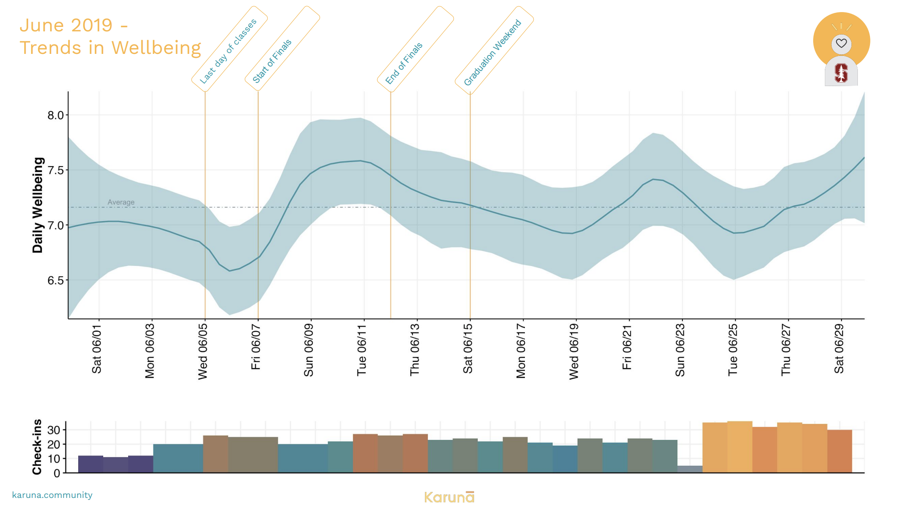

My phone chimed, “How was your day?” as it had every day for 3 months at 5:00 pm. Inspired by a talk on quantifying yourself, I recorded how satisfying the day went on a scale from 0-10. 
```{r setup, include=FALSE}
knitr::opts_chunk$set(echo = TRUE)
```


```{r Setup, include=FALSE}
library(here)
library(tidyverse)
library(readr)
library(kableExtra)
library(plotly)
library(viridis)
```


I approached the data as if it were an optimization problem: seven and a half hours of sleep, completing academic goals, road trips with friends, and physical activity maximizes satisfaction.

```{r, warning=FALSE,message=FALSE, echo = FALSE}
Satisfaction <- read_delim(here::here("content","post","2021-05-15-test-post","export/export_86745472-27C3-4591-BB63-AF5EC999E79B_20181106085105.csv"), 
    ";", escape_double = FALSE, trim_ws = TRUE, 
    skip = 2)


Sleep <- read_delim(here::here("content","post","2021-05-15-test-post","export/export_FE76EE25-8480-43A6-9D85-6D102831F27A_20181106085105.csv"), 
    ";", escape_double = FALSE, trim_ws = TRUE, 
    skip = 2)

Combined  <- merge(Sleep, Satisfaction, by = "Date")

names(Combined) <- c("Date", "Sleep.Entry", "Sleep", "Satisfaction.Entry", "Satisfaction")

Combined$betterDate <- as.Date(Combined$Date, "%m/%d/%y")

Combined$Date <- as.Date(ifelse(Combined$betterDate > Sys.Date(), 
  format(Combined$betterDate, "19%y-%m-%d"), 
  format(Combined$betterDate)))

ggplot(Combined, aes(x= Date, y = Satisfaction, color = as.integer(Date))) + geom_line(,size = 3)+ geom_point()+  ylim(0,10)+theme_classic() + scale_color_viridis_c() + theme(legend.position = "none",text = element_text(size=20)) + labs(y="Satisfaction on a 1-10 Scale", title = "How was your day? (5:00pm)")

```

Initially I wanted to understand how my satisfaction with the day has fluctuated throughout the month. Since I was recording time spent sleeping, I expected them both to correlate but the correlation is kind of weak. 

```{r sleep,  warning=FALSE,message=FALSE, echo = FALSE}
ggplot(Combined, aes(x= Date, y = Sleep, color = as.integer(Date))) + geom_line(size = 3)+ geom_point()+  ylim(0,10)+theme_classic() + scale_color_viridis_c() + theme(legend.position = "none",text = element_text(size=20)) + labs(y="Approximate Sleep in Hours", title = "How much sleep did you get?")

Gathered <- Combined %>%
  select(Date,Satisfaction,Sleep) %>%
  gather(key = Type,value = Amount,-Date)

#ggplot(Gathered, aes(x=Date, y= Amount, color = Type)) + geom_line() +theme_classic() + ylim(0,10) + theme(text = element_text(size=20), legend.position = "none")


ggplot(Combined, aes(x= Sleep, y = Satisfaction)) + geom_jitter(aes(color = as.integer(Date)))+ xlim(0,10) + ylim(0,10) +  geom_smooth(method='lm',formula=y~x,se = FALSE, color = "lightgrey")+theme_classic() + theme(legend.position = "none",text = element_text(size=20))+ scale_color_viridis_c()
```

However, after every day, whether I discovered a parking ticket on my windshield or showed my mom around Stanford’s campus for the first time on bikes, the next day tended to regress to the mean around 7/10. While this n of 1 experiment can guide your decisions, noticing trends only hints at insights.  

A few months later I signed up to be an early participant in a new mental health study on Stanford’s campus by a startup, Karuna Initiative. The company was using a texting platform to gauge graduate student mental health on the same 0-10 scale, followed by a brief journal entry, to organize community engagement and inform Stanford’s mental health initiatives. During a user focus group, I excitedly explained my experience recording my data for 3 months and joined them as a resident data scientist. While making [well-being reports](https://www.askadam.me/media/Karuna_report.pdf) for over 90 other Stanford graduate students, I realized the same phenomenon held. Through the anonymized data, I learned that finding out about a friend’s terminally ill condition is a 3, while to another student a flat tire is a 1. Students still tend to bounce back to around 7/10 between the extrema and with each experience, their capacity to enjoy their accomplishments or suffer their defeats only grows. A “hedonic treadmill” describes the tendency to return to the base level of happiness after major positive or negative life events. Discovering that we all are running on this treadmill encouraged me to search for the stories that data can tell us hidden in the heterogeneity in human experience.


