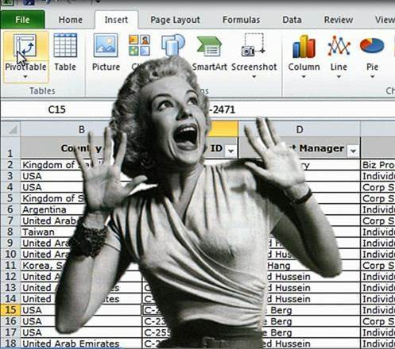
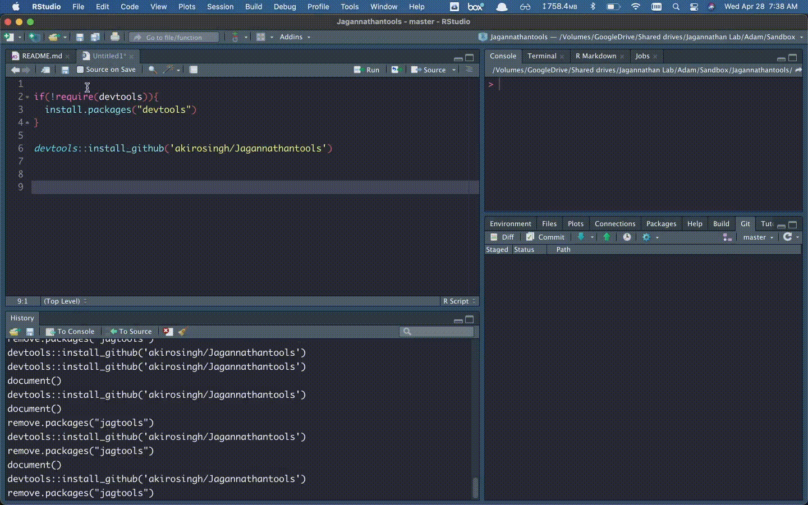
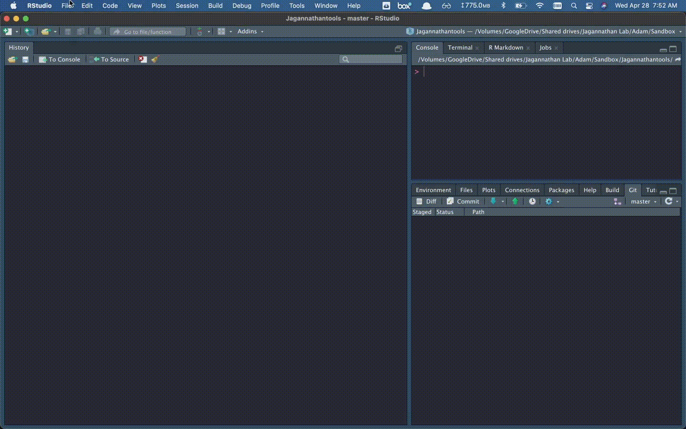

```{r setup, include=FALSE}
options(htmltools.dir.version = FALSE)
library(tidyverse)
library(jagtools)
library(here)
library(readxl)
library(readr)
library(rstatix)
library(ggpubr)
```

class: inverse, center, middle
# So you've finally gated all your cells on FlowJo. Your mouse-clicking fingers are tired and you just want to look at graphs 😌️

---
class: inverse, center, middle
# But it's not over! 😭️



---
class: inverse
# Import 📥️

# Tidy 🧹️

# Visualize 📈️

# Communicate 💬️

---
class: inverse, center, middle
# Tidyverse to the rescue ⛑️

---

background-image: url(https://www.storybench.org/wp-content/uploads/2017/05/tidyverse.png)
background-size: contain


---
class: inverse, center, middle

# But there is still a lot you need to figure out 🤔️

---
class: inverse
# Common painpoints:
### How do you structure your folders? 🚧️
### How do you combine all your csv from repeated experiments into a single data frame? 🤝️
### How do you fix Flowjo's default column headers? 🤕️
### How do you compare cell frequency populations to  categorical data 📊️ or continuous data? 📈️
### How do you make spice style 📦️ plots and 🥧 charts?

---


class: center, middle
background-image: url(https://raw.githubusercontent.com/akirosingh/Jagannathantools/master/inst/figures/redlogo.svg)
background-size: contain


---
class: inverse, center, middle

# Let's Get Started

---

# Hello World

Install the **jagtools** package from [Github](https://github.com/akirosingh/Jagannathantools):

```{r eval=FALSE, tidy=FALSE}
if(!require(devtools)){
    install.packages("devtools")
}

devtools::install_github('akirosingh/Jagannathantools')

```

---
# How do you structure your folders? 🚧️
Try this project template


---
# How do you structure your files? 🗄️
Try these rmd templates


---
## How do you combine all your csv from repeated experiments into a single data frame? 🤝️

Here is a nice function *import_flowjo*:
```{r comment='#', warning=F,message=F}
list.files(here("20210427\ Jagtools/data/rawdata/"))
df <- import_flowjo(directory = here("20210427\ Jagtools/data/rawdata/"))
head(df)
```


---
## How do you fix Flowjo's default column headers? 🤕️

Here is a nice function *rename_flowjo*:
```{r comment='#'}
rename_flowjo(df) %>%
  head()
```
---

## How do you compare cell frequency populations using categorical data? 📊

```{r load data, include=F}
# Importing a list of variables that we are interested in
varofinterest <- read_excel(here("20210427 Jagtools","data","kattria data","Lambda_Variable X Y combi.xlsx"))
# Importing a file consisting of patient information, an intracellular staining assay (ICS), and an activation induced marker assay (AIM)
masterfile <- read_csv(here("20210427 Jagtools","data","kattria data","aimicsclinneut.csv"))%>%
   subset(is.na(Stim.x)==F)

names(masterfile)[1] <- "id"

# Selecting which columns to use from the varofinterest excel spreadsheet
ics_cat <- masterfile %>%
   select(c(na.omit(varofinterest$`Y, ICS`), na.omit(varofinterest$`X, CAT`)), "Stim.x", "id") %>%
   mutate_at(vars(c(na.omit(varofinterest$`X, CAT`),"Stim.x")), list(factor)) %>%
   subset(!(Stim.x %in% c("PHA","MEDIA")))

combinations_ics_cat <- expand.grid(na.omit(varofinterest$`X, CAT`),na.omit(varofinterest$`Y, ICS`)) %>%
   rename(x_cats = "Var1", y_vars = "Var2") %>%
   mutate(x_cats = as.character(x_cats), y_vars = as.character(y_vars))

ics_num <- masterfile %>%
   select(c(na.omit(varofinterest$`Y, ICS`), na.omit(varofinterest$`X, NUM`)), "Stim.x", "id") %>%
   subset(!(Stim.x %in% c("PHA","MEDIA")))

combinations_ics_num <- expand.grid(na.omit(varofinterest$`X, NUM`),na.omit(varofinterest$`Y, ICS`)) %>%
   rename(x_nums = "Var1", y_vars = "Var2") %>%
   mutate(x_nums = as.character(x_nums), y_vars = as.character(y_vars))

# Spearman correlations:
ics_cor <- ics_num %>% 
   group_by(Stim.x) %>%
   cor_test(vars = na.omit(varofinterest$`X, NUM`), vars2 = na.omit(varofinterest$`Y, ICS`),method = "spearman")

all_cor <- ics_cor %>%
   mutate(bonferroni = signif(p.adjust(p, method = "bonferroni"),digits =3), BH = signif(p.adjust(p, method = "BH"),digits =3), holm = signif(p.adjust(p,method = "holm"),digits =3)) %>%
   arrange(BH)

combinations_ics_cat<- combinations_ics_cat[1,]
all_wilcox_ics_cat <-c()
for (i in 1:dim(combinations_ics_cat)[1]){
   wilcox_ics_cat <- wilcox_cat(df = ics_cat, x_cat = combinations_ics_cat$x_cats[i], y_var = combinations_ics_cat$y_vars[i],condition = "Stim.x")
   all_wilcox_ics_cat <- bind_rows(all_wilcox_ics_cat, wilcox_ics_cat)
}

all_wilcox_cat <- all_wilcox_ics_cat %>%
   mutate(bonferroni = signif(p.adjust(p, method = "bonferroni"),digits = 3), BH = signif(p.adjust(p, method = "BH"),digits = 3), holm = signif(p.adjust(p,method = "holm"),digits =3)) %>%
   arrange(BH)

 plot_cat_test <- function(df, x_cat, y_var) {
   # If you don't calculate all_wilcox_cat beforehand this is what you want  
    #   pairwise.test <- df %>% 
  #  group_by(Stim.x) %>%
  #  wilcox_test(formula =as.formula(substitute(a ~ i, list(a = as.name(y_var), i = as.name(x_cat)))))%>%
  # add_y_position(scales = "free_y")
  #  pairwise.test[[x_cat]] <- pairwise.test$group2

    # Here I am choosing to use BH for p.adj, use select(Stim.x:groups, !! sym(x_cat), bonferroni) for bonferroni
   pairwise.test <- all_wilcox_cat %>%
   select(Stim.x:groups, !! sym(x_cat), BH) %>%
   subset(.y. == y_var) %>%
   na.omit()

   graph <- df %>%
   tidyr::drop_na(!! sym(x_cat)) %>%
   ggplot(aes_string(x = x_cat, y = y_var, fill = x_cat)) +
   geom_boxplot() +
   scale_fill_hue() +
   theme_minimal() +
   facet_wrap(~Stim.x, scales = "free_y")+
  scale_y_continuous(expand = expansion(mult = c(0, 0.1)))

   # Note: if you want to compare P values without the multiple hypothesis correction you'll want to change "BH" to "p".
   graph + stat_pvalue_manual(
    pairwise.test, label = "BH", tip.length = 0.01
)
 }

plot_num_test <- function(df, x_num, y_var){
   correlations <- all_cor %>%
   subset(var1 == x_num & var2 == y_var) 
   
   graph <-df %>%
   ggplot(aes(x = !!sym(x_num), y = !!sym(y_var), color = Stim.x)) +
   geom_point() +geom_smooth(method="loess", se=TRUE,  fullrange=FALSE, level=0.95, formula=y~x)+
   theme_minimal()+  geom_text(data = correlations, mapping = aes(x = -Inf, y = Inf, color = Stim.x, label = paste("p-value= ",BH,", rho=", cor),hjust= 0,vjust=1)) +
   facet_wrap(~Stim.x, scales = "free") +
      theme(legend.position = "none")
   graph 
   
   # This older graph didn't use corrected p values
  #  graph <-df %>%
  #  ggplot(aes_string(x = x_num, y = y_var, color = "Stim.x")) +
  #  geom_point() +geom_smooth(method="loess", se=TRUE,  fullrange=FALSE, level=0.95, formula=y~x)+
  # stat_cor(method="spearman", p.accuracy = 0.001,
  #         cor.coef.name = "rho", size=4)+
  #  theme_minimal() +
  #  facet_wrap(~Stim.x, scales = "free") +
  #     theme(legend.position = "none")
  #  graph
}
 
```

*plot_cat*
```{r fig.height=4, dev='svg', warning=F,message=F}
plot_cat_test(df = ics_cat, x_cat = combinations_ics_cat$x_cats[1], y_var = combinations_ics_cat$y_vars[1])

```
---
## How do you compare cell frequency populations using continuous data? 📈️
*plot_num*
```{r fig.height=4, dev='svg', warning=F,message=F}
plot_num_test(ics_num, combinations_ics_num$x_nums[1], combinations_ics_num$y_vars[1])
```
---
## How do you make spice style 📦️ plots?
TODO: formalize into function
```{r include = F}
df <- read_excel(here("20210427\ Jagtools/data/kattria data/Lambda ICS D28_bgsub_clinical_Spice.xlsx")) %>%
  select(`CD4_CD107a+IFNy+IL10+IL21+TNF+`:`CD4_CD107a-IFNy-IL10-IL21-TNF+`, SampleID, Stim,severitycat)

# Defining the variables in the column names 
boolean_types <- c("CD4_CD107a","IFNy","IL10","IL21","TNF")
# These are the ones that Kattria actually cares about
boolean_interest <- c("IFNy","IL21","TNF")

# Creating a table to merge and simplify IL10 and CD4_CD107a
combinations <- expand.grid(c("-","+"),c("-","+"),c("-","+"),c("-","+"),c("-","+"))
names(combinations) <- boolean_types
complete_combinations <- combinations%>%
  mutate(boolean_complete = paste0(CD4_CD107a,IFNy,IL10,IL21,TNF), boolean_subset = paste0(IFNy,IL21,TNF)) %>%
  select(boolean_complete,boolean_subset)

# Making the data long instead of wide and combining the datasets
longdf <- df %>%
  pivot_longer(-c(severitycat,SampleID,Stim),names_to = "Cell_subset", values_to = "percentage") %>%
  mutate(boolean_complete = reduce2(boolean_types, rep("",length(boolean_types)) ,.init = Cell_subset, str_replace)) %>%
  left_join(y = complete_combinations,by = "boolean_complete") %>%
  mutate(boolean_axis = gsub("(?<=.)(?=.)", "\n", boolean_subset, perl = TRUE)) %>%
  group_by(Stim,SampleID,boolean_axis, severitycat) %>%
  summarize(`Percentage of Cells` = sum(percentage,na.rm = T)) %>%
  subset(is.na(severitycat)==F)
MN_df<- longdf %>%
  subset(Stim=="MN") %>%
  subset(boolean_axis != "-\n-\n-")


MN_df$`Percentage of Cells`[MN_df$`Percentage of Cells`<0] <- 0

df_boxplot <- MN_df %>%
ggplot() +
 aes(x = boolean_axis, y = `Percentage of Cells`,color = severitycat) +
 geom_boxplot() +
 scale_fill_hue() +
 theme_minimal() + annotate("text", x = 0, y=-0.06, label = paste0(boolean_interest,collapse= "\n"),size=3 ) +
    coord_cartesian(xlim = c(1,length(unique(MN_df$boolean_axis))), ylim = c(0,max(MN_df$`Percentage of Cells`,na.rm = T)),clip = "off") + labs(x = "") 

```

```{r fig.height=4, dev='svg'}
df_boxplot
```
---
## How do you make spice style 🥧 charts?
TODO: Make this plot function

---

# Roadmap 🛣️

## Finish spice style piechart

## How might we remove FlowJo from the analysis and do it all through R or python?

## How might we apply batch correction across experiments with a reference samples?

## What are some problems you've run into when analyzing data?

---
# Special thanks to Emma 🙏️ for the design ideas and helping me with testing code/organizing ideas.

---

class: center, middle

# Thanks!
## If you have any issues please contact me at adamsk@stanford.edu or add it to the [github page](https://github.com/akirosingh/Jagannathantools/issues)

Slides created via the R package [**xaringan**](https://github.com/yihui/xaringan)

